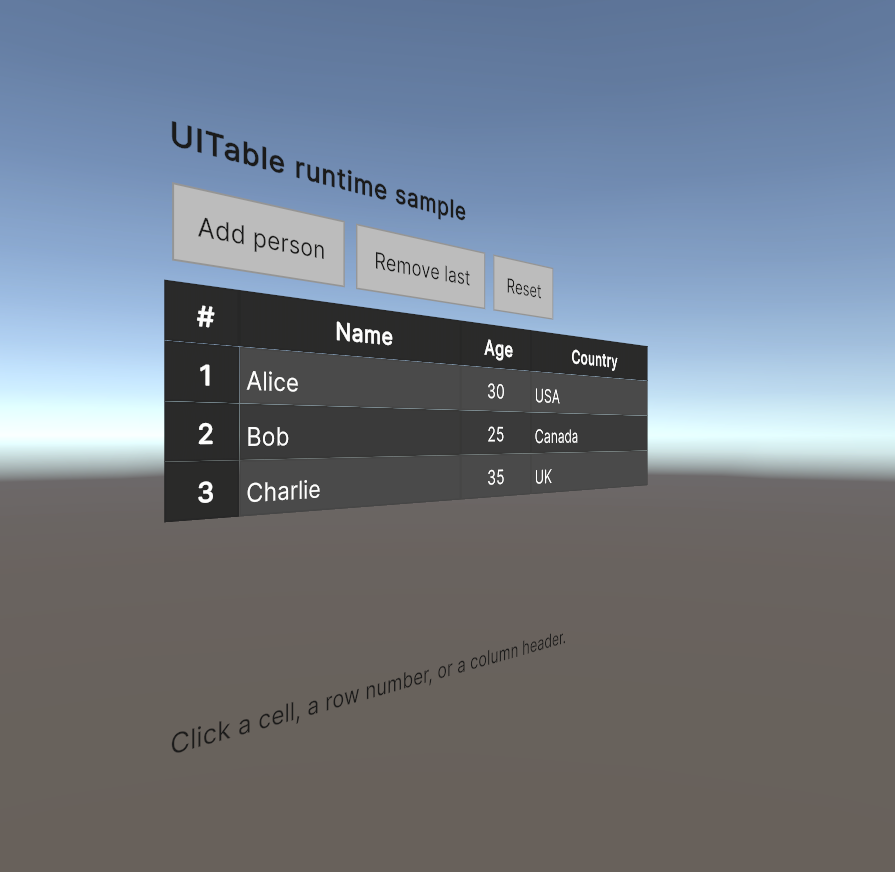

# UIElement Table

## Overview
UIElement Table is a Unity package that provides a way to draw tables with UIElements.

## Installation
To install UIElement Table into your Unity project, add the package from the git URL: https://github.com/PaulNonatomic/UIElementTable.git using the Unity package manager.

## Usage
```csharp
// Create a table
_table = new DataBindingUITable<Person>();
rootVisualElement.Add(_table);

// Style the table
var styleSheet = Resources.Load<StyleSheet>("CustomTable");
_table.SetCustomStyleSheet(styleSheet);

// Show row numbers (optional)
_table.ShowRowNumbers(new ColumnDefinition("#", 50f));

// Define columns using AddColumn with a cell creation func
_table.AddColumn(
    new ColumnDefinition("Name", 150f),
    person => new Label(person.Name)
);
_table.AddColumn(
    new ColumnDefinition("Age", 75f),
    person => new Label(person.Age.ToString())
);
_table.AddColumn(
    new ColumnDefinition("Country"),
    person => new Label(person.Country)
);

// Listen for cell clicks
_table.RegisterCallback<TableCellClickEvent>(evt =>
{
    var cell = _table.GetCell(evt.ColumnIndex, evt.RowIndex);
    var label = cell.Q<Label>();
    Debug.Log($"Clicked on cell: Column={evt.ColumnIndex}, Row={evt.RowIndex}, Value={label.text}");
});

// Populate the table with data
var people = new List<Person>
{
    new Person("Alice", 30, "USA"),
    new Person("Bob", 25, "Canada"),
    new Person("Charlie", 35, "UK")
};
_table.SetData(people);

public class Person
{
	public string Name;
	public int Age;
	public string Country;

	public Person(string name, int age, string country)
	{
		Name = name;
		Age = age;
		Country = country;
	}
}
```


## World space

A `UITable` is standard UI Toolkit content, so it renders in a world-space `UIDocument` just as it does on screen (world-space UI Toolkit requires Unity 6.2+):



## Styling

`SetCustomStyleSheet` (above) layers a custom stylesheet over the default look. The table's appearance is driven by USS variables on `.ui-table`, so a theme is just a short override:

```css
.ui-table {
    --text-color: #1f2933;
    --header-bg-color: #dfe3e8;
    --row-even-bg-color: #ffffff;
    --row-odd-bg-color: #f1f3f5;
    --highlight-bg-color: #cfe3ff;
}
```

The samples include Light and Ocean themes and a scenario that swaps them at runtime.

## Samples

Import **UITable Examples** from the package's Samples tab in the Package Manager: an editor validation harness, runtime and world-space sample scenes, and the theme examples.


